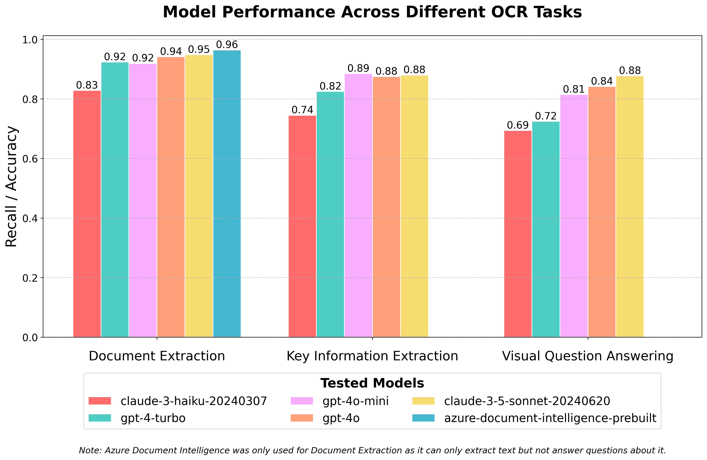

# A small OCR benchmark for LLMs & Azure Document Intelligence

I haven't found any good comparisons of the capabilities of various LLMs & Azure Document Intelligence. Often the question arises whether LLMs are capable enough to compete with specialized OCR solutions. Based on this benchmark, I would say yes, but with some caveats.

## Results

### OCR Benchmark Results

Here, a simple benchmark is conducted for various models across three key tasks: Document Extraction, Key Information Extraction, and Visual Question Answering. The following models were evaluated:

- Azure Document Intelligence (prebuilt)
- GPT-4 Turbo
- GPT-4o Mini
- Claude-3 Haiku
- GPT-4o
- Claude-3.5 Sonnet

The tasks are:

1. **Document Extraction**: A simple retrieval task where the model has to recall all the contents of the given documents. The recall score is just the percentage of words that is found by the model. For this, I am using the FUNSD dataset from https://guillaumejaume.github.io/FUNSD/.
*Scoring* is kept minimalistic/simplistic: For each label (with a length of 3 or longer) of the test dataset, I check if it's contained in the model's output. I also ignored capitalization as this is rarely relevant for practical use cases. Getting the capitalization right was rarely a problem for LLMs anyway.

2. **Key Information Extraction** & **Visual Question Answering**: These are tasks from the following benchmark test set: https://github.com/Yuliang-Liu/MultimodalOCR
Here, I am focusing on the document-oriented visual question answering and the key information extraction categories. These tasks are more than just retrieving; rather, specific questions are asked, and sometimes multiple points of information have to be found in an image and combined to come to the correct conclusion.
Here, *scoring* was slightly more involved, as the labels are often too strict or the questions ambiguous. Especially for retrieving quantities like weight, volumes, and amount of money, the official labels would only give the number, whereas the model gave the units as well. The latter seems more appropriate to me (e.g., the label said "300" and the model retrieved "300 million €," which was actually correct given the document's contents).

Each dataset contains 200 examples.

#### Combined Results in One Plot

### Key Findings:

1. **Document Extraction**:
   - Azure Document Intelligence performed exceptionally well, achieving the highest accuracy (96%).
   - This can be considered almost perfect, given that I observed that the dataset contained some false labels.
   - The LLMs are very close to this result. I only did basic prompt engineering; with few-shot + majority voting, one can probably beat the ADI model. But generally, the dataset might be too easy to properly differentiate between the models' capabilities.

2. **Key Information Extraction** & **Visual Question Answering**:
   - We've seen a significant jump between last year's models and the newest generation.
   - For the false positives, I found a few cases where the actual labels were wrong or the model answer was too complete, such that a match with a label was not possible (e.g., model response "26 kcal (109 kJ)" can't be matched with label "26 kcal").
   - However, there are also many genuine wrong model responses. These can be traced back to the model confusing different numbers, or where information needed to be aggregated to come to a conclusion, or where the question asked for some position-dependent information like "What is the value of the middle bar?"

## Conclusion

The takeaway of this brief study should **not** be that multimodal LLMs can potentially replace specialized OCR solutions. Here are a few reasons why specialized OCR tools will stay with us for some time:
- They can be customized for more complex forms, whereas for proprietary LLMs, we can only do prompt engineering.
- They have confidence scores for their predictions.
- While they can miss information, they usually don't hallucinate information as they are built on a completely different architecture (CNNs).
- They provide precise position information about where text is located in documents.
- They can detect styles and fonts.

On the other hand, LLMs have the ability to directly answer questions, which has the potential to drastically simplify previously used OCR pipelines as it combines the extraction and selection of information. Also, they have at least some weak reasoning capabilities that CNNs don't have. If, for instance, characters are illegible or ambiguous, LLMs can fill in the blanks using their common knowledge. The downside of this is, of course, the phenomenon called hallucination, where they will add information that sounds plausible in the given context despite it being factually wrong.
However, I did not really find cases where LLMs would straight up hallucinate information.

Possibly, the optimal solution is combining both specialized OCR models with LLMs to extract specific information and answer questions.